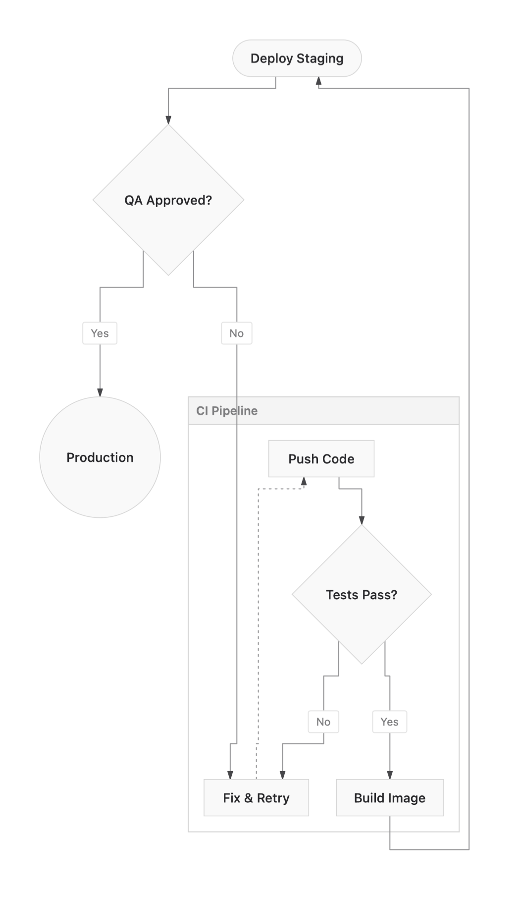
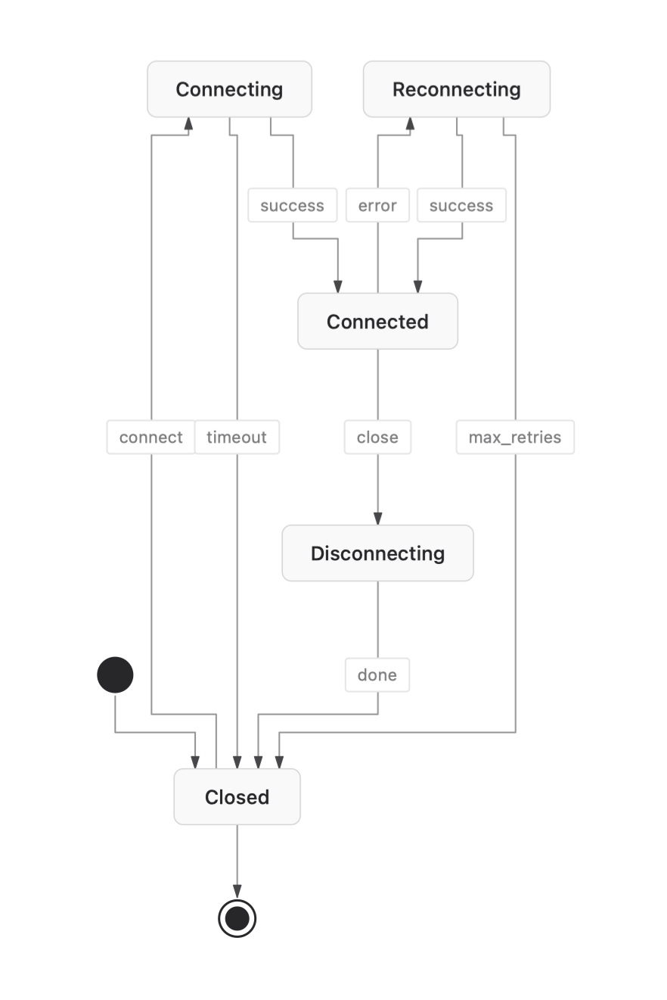
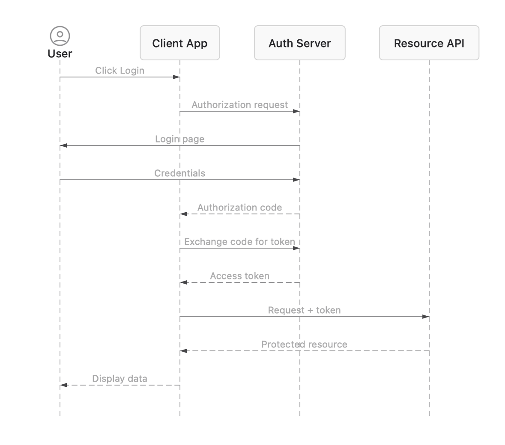
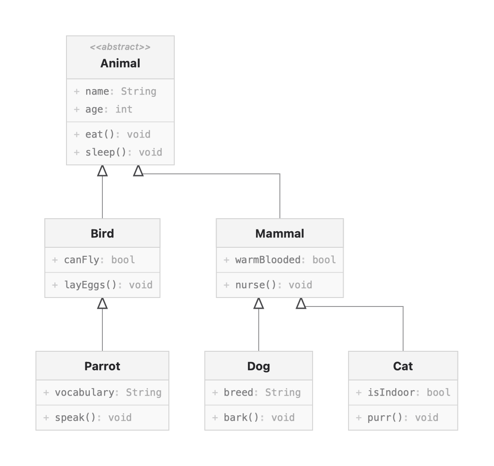
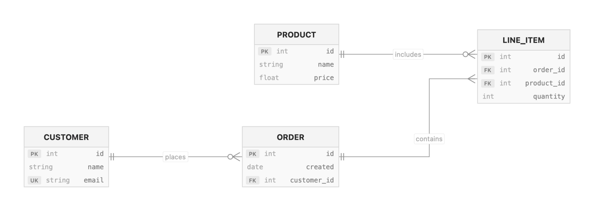

<div align="center">

# BeautifulMermaid

**Render Mermaid diagrams as beautiful native images**

A native Swift implementation of [beautiful-mermaid](https://github.com/lukilabs/beautiful-mermaid).

[](https://swift.org)
[](https://developer.apple.com)
[](https://swift.org/package-manager/)
[](LICENSE)

</div>

## Overview

BeautifulMermaid is a native Swift port of [beautiful-mermaid](https://github.com/lukilabs/beautiful-mermaid). Parse and render Mermaid diagrams without WebViews or JavaScript.

## Features

- **5 diagram types** - Flowcharts, State, Sequence, Class, ER diagrams (Gantt, Pie, Git, Journey, etc. not supported)
- **Native image output** - `UIImage` / `NSImage` for all Apple platforms
- **15 built-in themes** - Tokyo Night, Dracula, Nord, and more
- **Mono mode** - Beautiful diagrams from just 2 colors
- **Pure Swift** - No WebView, no JavaScript
- **Cross-platform** - iOS, macOS, Mac Catalyst

## Installation

### Swift Package Manager

Add BeautifulMermaid to your `Package.swift`:

```swift
dependencies: [
    .package(url: "https://github.com/lukilabs/beautiful-mermaid-swift", from: "0.1.0")
]
```

Then add it to your target dependencies:

```swift
.target(
    name: "YourTarget",
    dependencies: [.product(name: "BeautifulMermaid", package: "beautiful-mermaid-swift")]
)
```

## Quick Start

```swift
import BeautifulMermaid

let mermaidCode = """
graph TD
    A[Start] --> B{Decision}
    B -->|Yes| C[Do Something]
    B -->|No| D[Do Something Else]
    C --> E[End]
    D --> E
"""

// Render with default theme
let image = try MermaidRenderer.renderImage(source: mermaidCode)

// Render with a specific theme
let darkImage = try MermaidRenderer.renderImage(
    source: mermaidCode,
    theme: .tokyoNight
)
```

### UIKit / AppKit Integration

`MermaidView` is a native `UIView` (iOS) / `NSView` (macOS) subclass:

```swift
import BeautifulMermaid

// Create the view
let mermaidView = MermaidView(frame: CGRect(x: 0, y: 0, width: 400, height: 300))
mermaidView.source = "graph TD; A-->B; B-->C;"
mermaidView.theme = .catppuccinMocha

// Add to your view hierarchy
view.addSubview(mermaidView)
```

For SwiftUI, wrap it in a `UIViewRepresentable` / `NSViewRepresentable`:

```swift
import SwiftUI
import BeautifulMermaid

struct MermaidDiagramView: UIViewRepresentable {
    let source: String
    var theme: DiagramTheme = .default

    func makeUIView(context: Context) -> MermaidView {
        MermaidView(frame: .zero)
    }

    func updateUIView(_ uiView: MermaidView, context: Context) {
        uiView.source = source
        uiView.theme = theme
    }
}
```

## Theming

### Two-Color Theming

BeautifulMermaid's theming system is built around simplicity. At minimum, you only need **two colors**:

```swift
let theme = DiagramTheme(
    background: "#1a1b26",  // Background color
    foreground: "#c0caf5"   // Text/line color
)
```

From these two colors, the system automatically derives:
- Text colors (primary, secondary, labels)
- Node fill and stroke colors
- Edge and arrow colors
- All other UI elements

### Optional Enrichment Colors

For more control, add optional accent colors:

```swift
let theme = DiagramTheme(
    background: "#1a1b26",
    foreground: "#c0caf5",
    line: "#565f89",        // Edge lines
    accent: "#7aa2f7",      // Highlighted elements
    muted: "#414868",       // De-emphasized elements
    surface: "#24283b",     // Node backgrounds
    border: "#414868"       // Node borders
)
```

### Built-in Themes

| Theme | Description |
|-------|-------------|
| `.zincLight` / `.zincDark` | Default, clean appearance |
| `.tokyoNight` / `.tokyoNightStorm` / `.tokyoNightLight` | Popular VS Code theme |
| `.catppuccinMocha` / `.catppuccinLatte` | Soothing pastel colors |
| `.nord` / `.nordLight` | Arctic-inspired palette |
| `.dracula` | Classic dark theme |
| `.githubLight` / `.githubDark` | Familiar GitHub style |
| `.solarizedLight` / `.solarizedDark` | Eye-friendly colors |
| `.oneDark` | Atom editor style |

## Supported Diagrams

### Flowcharts

<picture>
  <source media="(prefers-color-scheme: dark)" srcset="assets/examples/flowchart-dark.png">
  <source media="(prefers-color-scheme: light)" srcset="assets/examples/flowchart-light.png">
  
</picture>

```
graph TD
    A[Start] --> B{Decision}
    B -->|Yes| C[Do Something]
    B -->|No| D[Do Something Else]
    C --> E[End]
    D --> E
```

### State Diagrams

<picture>
  <source media="(prefers-color-scheme: dark)" srcset="assets/examples/state-dark.png">
  <source media="(prefers-color-scheme: light)" srcset="assets/examples/state-light.png">
  
</picture>

```
stateDiagram-v2
    [*] --> Idle
    Idle --> Processing: start
    Processing --> Complete: finish
    Processing --> Error: fail
    Error --> Idle: reset
    Complete --> [*]
```

### Sequence Diagrams

<picture>
  <source media="(prefers-color-scheme: dark)" srcset="assets/examples/sequence-dark.png">
  <source media="(prefers-color-scheme: light)" srcset="assets/examples/sequence-light.png">
  
</picture>

```
sequenceDiagram
    participant Client
    participant Server
    participant Database
    Client->>Server: Request
    Server->>Database: Query
    Database-->>Server: Results
    Server-->>Client: Response
```

### Class Diagrams

<picture>
  <source media="(prefers-color-scheme: dark)" srcset="assets/examples/class-dark.png">
  <source media="(prefers-color-scheme: light)" srcset="assets/examples/class-light.png">
  
</picture>

```
classDiagram
    Animal <|-- Duck
    Animal <|-- Fish
    Animal : +String name
    Animal : +makeSound()
    Duck : +swim()
    Fish : +swim()
```

### ER Diagrams

<picture>
  <source media="(prefers-color-scheme: dark)" srcset="assets/examples/er-dark.png">
  <source media="(prefers-color-scheme: light)" srcset="assets/examples/er-light.png">
  
</picture>

```
erDiagram
    CUSTOMER ||--o{ ORDER : places
    ORDER ||--|{ LINE_ITEM : contains
    PRODUCT ||--o{ LINE_ITEM : includes
```

### Parser Limitations

The parser handles standard Mermaid syntax for supported diagram types. The following features are **not supported**:

- HTML in node labels
- Click callbacks and links
- Tooltips
- FontAwesome icons
- Multiline labels with `<br>` tags
- Styling via `style` and `linkStyle` directives (partial support)
- Subgraph styling

If your diagram uses these features, they will be silently ignored or may cause unexpected output.

## Configuration

### Render Options

```swift
let image = try MermaidRenderer.renderImage(
    source: code,
    theme: .tokyoNight,
    scale: 2.0                // Retina scale (default: 2.0)
)
```

### Layout Directions

Specify direction in your Mermaid code:

- `graph TD` or `graph TB` - Top to bottom (default)
- `graph BT` - Bottom to top
- `graph LR` - Left to right
- `graph RL` - Right to left

## Requirements

- Swift 5.9+
- iOS 15+ / macOS 12+ / Mac Catalyst 15+

## License

MIT License - see [LICENSE](LICENSE) for details.

## Acknowledgments

- [beautiful-mermaid](https://github.com/lukilabs/beautiful-mermaid) - Original TypeScript implementation by Craft
- [SwiftDagre](https://github.com/lukilabs/dagre-swift) - Graph layout algorithm
- [Mermaid](https://mermaid.js.org/) - Diagramming syntax specification
