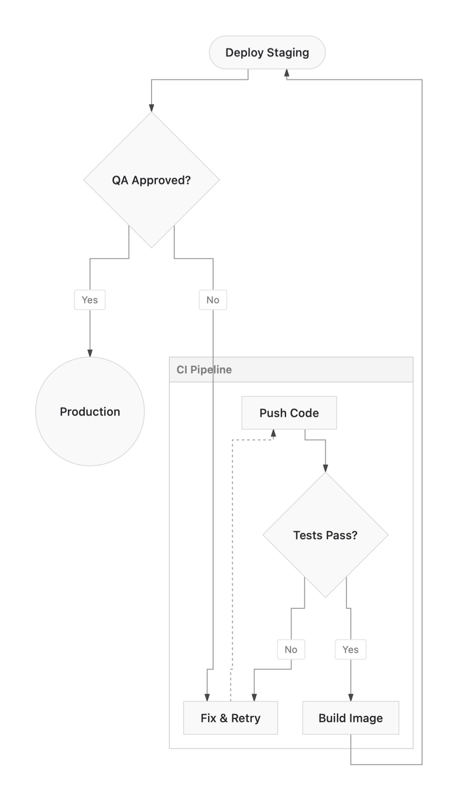
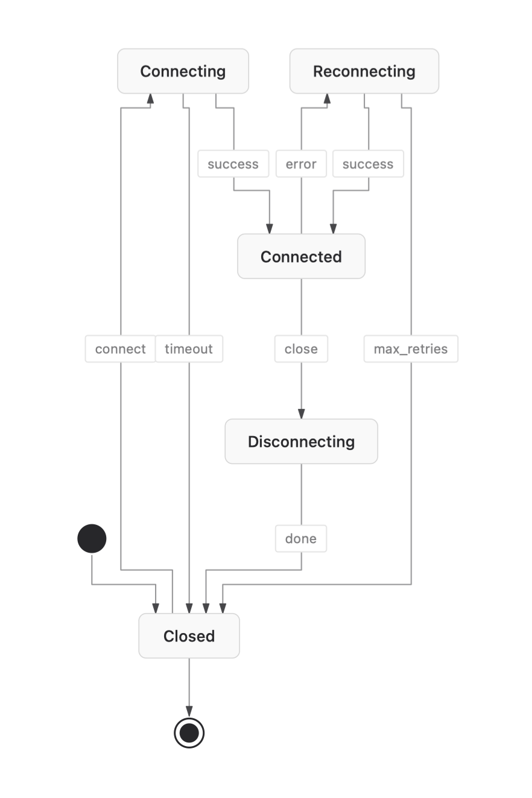
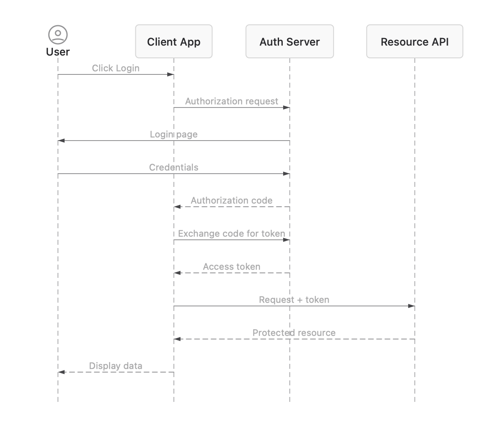
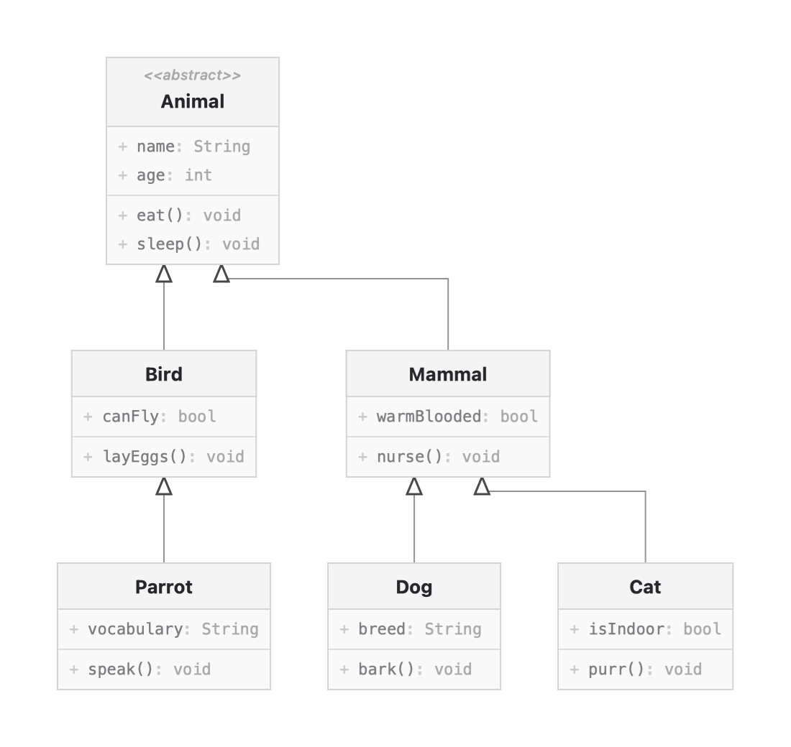
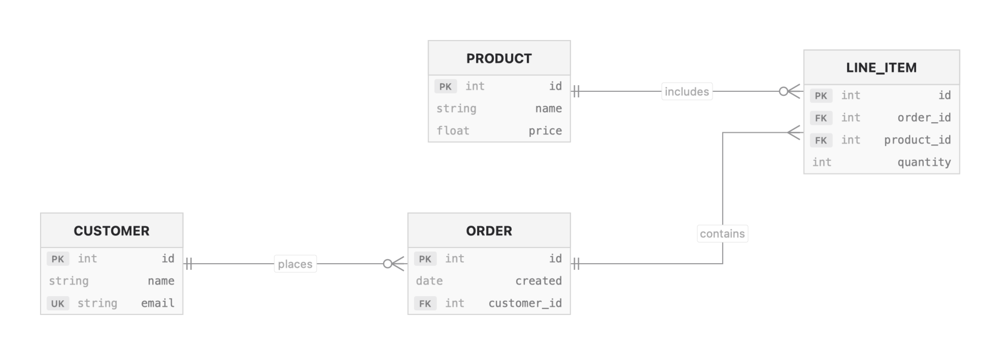
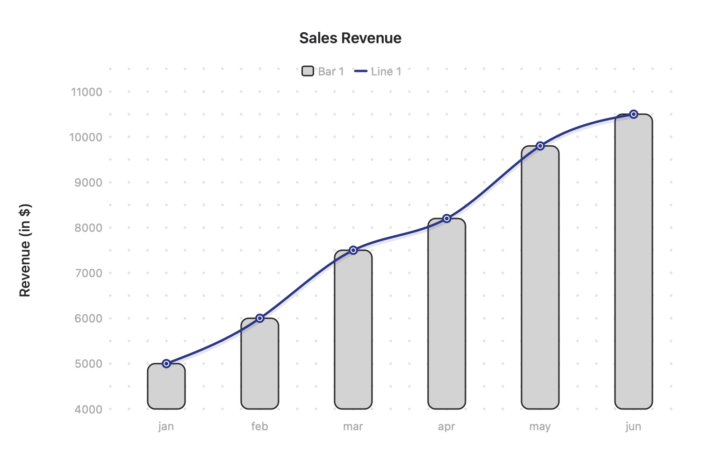

<div align="center">

# BeautifulMermaid

**Render Mermaid diagrams as beautiful native images, SVGs, and ASCII art**

A native Swift implementation of [beautiful-mermaid](https://github.com/lukilabs/beautiful-mermaid), powered by the [ELK](https://www.eclipse.org/elk/) layout engine.

[](https://swift.org)
[](https://developer.apple.com)
[](https://swift.org/package-manager/)
[](LICENSE)

</div>

## Overview

BeautifulMermaid is a native Swift port of [beautiful-mermaid](https://github.com/lukilabs/beautiful-mermaid). Parse and render Mermaid diagrams without WebViews or JavaScript. Uses [elk-swift](https://github.com/lukilabs/elk-swift) for graph layout — a minimal Swift port of the Eclipse Layout Kernel.

## Features

- **6 diagram types** — Flowcharts, State, Sequence, Class, ER, and XY Charts
- **Multiple output formats** — Native images (`UIImage` / `NSImage`), SVG, and ASCII art
- **17 built-in themes** — Tokyo Night, Dracula, Nord, Gruvbox, and more
- **VS Code theme import** — Load any Shiki/VS Code theme via `ShikiTheme`
- **Mono mode** — Beautiful diagrams from just 2 colors
- **SwiftUI integration** — Built-in `MermaidDiagramView` with a value-type `MermaidDiagram` model
- **CALayer rendering** — `MermaidLayer` for lightweight, direct Core Graphics rendering
- **Async rendering** — All render methods available as `async` variants
- **Pure Swift** — No WebView, no JavaScript
- **Cross-platform** — iOS 15+, macOS 12+, Mac Catalyst 15+, visionOS 1.0+

## Installation

### Swift Package Manager

Add BeautifulMermaid to your `Package.swift`:

```swift
dependencies: [
    .package(url: "https://github.com/lukilabs/beautiful-mermaid-swift", from: "1.0.0")
]
```

Then add it to your target dependencies:

```swift
.target(
    name: "YourTarget",
    dependencies: [.product(name: "BeautifulMermaid", package: "beautiful-mermaid-swift")]
)
```

## Quick Start

```swift
import BeautifulMermaid

let mermaidCode = """
graph TD
    A[Start] --> B{Decision}
    B -->|Yes| C[Do Something]
    B -->|No| D[Do Something Else]
    C --> E[End]
    D --> E
"""

// Render as image
let image = try MermaidRenderer.renderImage(source: mermaidCode)

// Render as SVG
let svg = try MermaidRenderer.renderSVG(source: mermaidCode, theme: .tokyoNight)

// Render as ASCII art
let ascii = try MermaidRenderer.renderASCII(source: mermaidCode, theme: .zincDark)
```

### SwiftUI

Use the built-in `MermaidDiagramView`:

```swift
import SwiftUI
import BeautifulMermaid

struct ContentView: View {
    var body: some View {
        MermaidDiagramView(
            source: "graph TD; A-->B; B-->C;",
            theme: .catppuccinMocha
        )
    }
}
```

### UIKit / AppKit

`MermaidView` is a native `UIView` (iOS) / `NSView` (macOS) subclass:

```swift
import BeautifulMermaid

let mermaidView = MermaidView(frame: CGRect(x: 0, y: 0, width: 400, height: 300))
mermaidView.source = "graph TD; A-->B; B-->C;"
mermaidView.theme = .catppuccinMocha
view.addSubview(mermaidView)
```

### Image Export

Export diagrams as PNG or JPEG data:

```swift
let renderer = MermaidImageRenderer()
renderer.theme = .dracula
renderer.scale = 3.0

let pngData = try renderer.renderPNG(from: mermaidCode)
let jpegData = try renderer.renderJPEG(from: mermaidCode, quality: 0.9)
```

### Async Rendering

All render methods have async variants for background processing:

```swift
let image = try await MermaidRenderer.renderImageAsync(source: mermaidCode, theme: .nord)
let svg = try await MermaidRenderer.renderSVGAsync(source: mermaidCode)
let ascii = try await MermaidRenderer.renderASCIIAsync(source: mermaidCode)
```

## Theming

### Two-Color Theming

At minimum, you only need **two colors**:

```swift
let theme = DiagramTheme(
    background: "#1a1b26",  // Background color
    foreground: "#c0caf5"   // Text/line color
)
```

From these two colors, the system automatically derives text colors, node fills, strokes, edge colors, and all other UI elements.

### Optional Enrichment Colors

For more control, add optional accent colors:

```swift
let theme = DiagramTheme(
    background: "#1a1b26",
    foreground: "#c0caf5",
    line: "#565f89",        // Edge lines
    accent: "#7aa2f7",      // Highlighted elements
    muted: "#414868",       // De-emphasized elements
    surface: "#24283b",     // Node backgrounds
    border: "#414868"       // Node borders
)
```

### VS Code / Shiki Theme Import

Import any VS Code color theme:

```swift
let shikiTheme = DiagramTheme.ShikiTheme(
    type: "dark",
    colors: [
        "editor.background": "#1e1e1e",
        "editor.foreground": "#d4d4d4",
        "focusBorder": "#007acc"
    ],
    tokenColors: []
)

let theme = DiagramTheme.fromShikiTheme(shikiTheme)
```

### Built-in Themes

| Theme | Description |
|-------|-------------|
| `.zincLight` / `.zincDark` | Default, clean appearance |
| `.tokyoNight` / `.tokyoNightStorm` / `.tokyoNightLight` | Popular VS Code theme |
| `.catppuccinMocha` / `.catppuccinLatte` | Soothing pastel colors |
| `.nord` / `.nordLight` | Arctic-inspired palette |
| `.dracula` | Classic dark theme |
| `.githubLight` / `.githubDark` | Familiar GitHub style |
| `.solarizedLight` / `.solarizedDark` | Eye-friendly colors |
| `.oneDark` | Atom editor style |
| `.gruvboxDark` / `.gruvboxLight` | Retro groove colors |

## Supported Diagrams

### Flowcharts

<picture>
  <source media="(prefers-color-scheme: dark)" srcset="assets/examples/flowchart-dark.png">
  <source media="(prefers-color-scheme: light)" srcset="assets/examples/flowchart-light.png">
  
</picture>

<details>
<summary>ASCII art output</summary>

```
┌────────────────────────────────────────┐
│              CI Pipeline               │
│                                        │
│                                        │
│ ┌────────────────┐                     │
│ │                │                     │
│ │   Push Code    │◄┄┄┄┄┄┄┄┄┄┄┄┐        │
│ │                │            ┆        │
│ └────────┬───────┘            ┆        │
│          │                    ┆        │
│          │                    ┆        │
│          │                    ┆        │
│          │                    ┆        │
│          ▼                    ┆        │
│ ◇────────────────◇            ┆        │
│ │                │            ┆        │
│ │  Tests Pass?   ├────────────┐        │
│ │                │            ┆        │
│ ◇────────┬───────◇           No        │
│          │                    ┆        │
│         Yes                   ┆        │
│          │                    ┆        │
│          │                    ┆        │
│          ▼                    ▼        │
│ ┌────────────────┐     ┌──────┴──────┐ │
│ │                │     │             │ │
│ │  Build Image   │     │ Fix & Retry │ │
│ │                │     │             │ │
│ └────────┬───────┘     └─────────────┘ │
│          │                    ▲        │
└──────────┼────────────────────┼────────┘
           │                    │
           │                    │
           ▼                    │
  (────────────────)            │
  │                │            │
  │ Deploy Staging │            │
  │                │            │
  (────────┬───────)            │
           │                    │
           │                    │
           │                   No
           │                    │
           ▼                    │
  ◇────────────────◇            │
  │                │            │
  │  QA Approved?  ├────────────┘
  │                │
  ◇────────┬───────◇
           │
          Yes
           │
           │
           ▼
  ◯────────────────◯
  │                │
  │   Production   │
  │                │
  ◯────────────────◯
```
</details>

```
graph TD
    subgraph ci [CI Pipeline]
        A[Push Code] --> B{Tests Pass?}
        B -->|Yes| C[Build Image]
        B -->|No| D[Fix & Retry]
        D -.-> A
    end
    C --> E([Deploy Staging])
    E --> F{QA Approved?}
    F -->|Yes| G((Production))
    F -->|No| D
```

### State Diagrams

<picture>
  <source media="(prefers-color-scheme: dark)" srcset="assets/examples/state-dark.png">
  <source media="(prefers-color-scheme: light)" srcset="assets/examples/state-light.png">
  
</picture>

<details>
<summary>ASCII art output</summary>

```
●───────────────●
│               │
●───────────────●
        │
        │
        │
        │
        ▼
╭───────────────╮
│               │
│     Closed    │  ├done──┬────────────────────────┐
│               │         │                        │
╰───────┬───────╯         │                        │
        ▲                 │                        │
     connect              │                        │
        │                 │                        │
     timeout              │                        │
        ▼                 │                        ▼
╭───────┴───────╮         │          ╔══════════════════════════╗
│               │         │          ║                          ║
│   Connecting  │         │          ║                          ║
│               │         │          ║                          ║
╰───────┬───────╯         │          ╚══════════════════════════╝
        │                 │
     success              │
        │                 │
        │                 │
        ▼                 │
╭───────────────╮         ├──────────┐
│               │         │          │
│   Connected   │  ├◄─────┼─────success────────────┐
│               │         │          │             │
╰───────┬───────╯         │          │           error
        │                 │          │             │
      close               │          │             │
        │                 │          └─max_retries─┤
        │                 │                        │
        ▼                 │                        ▼
╭───────────────╮         │          ╭─────────────┴────────────╮
│               │         │          │                          │
│ Disconnecting │  ├──────┘          │       Reconnecting       │
│               │                    │                          │
╰───────────────╯                    ╰──────────────────────────╯
```
</details>

```
stateDiagram-v2
    [*] --> Closed
    Closed --> Connecting : connect
    Connecting --> Connected : success
    Connecting --> Closed : timeout
    Connected --> Disconnecting : close
    Connected --> Reconnecting : error
    Reconnecting --> Connected : success
    Reconnecting --> Closed : max_retries
    Disconnecting --> Closed : done
    Closed --> [*]
```

### Sequence Diagrams

<picture>
  <source media="(prefers-color-scheme: dark)" srcset="assets/examples/sequence-dark.png">
  <source media="(prefers-color-scheme: light)" srcset="assets/examples/sequence-light.png">
  
</picture>

<details>
<summary>ASCII art output</summary>

```
┌──────┐       ┌────────────┐               ┌─────────────┐  ┌──────────────┐
│ User │       │ Client App │               │ Auth Server │  │ Resource API │
└───┬──┘       └──────┬─────┘               └──────┬──────┘  └───────┬──────┘
    │                 │                            │                 │
    │   Click Login   │                            │                 │
    │─────────────────▶                            │                 │
    │                 │                            │                 │
    │                 │   Authorization request    │                 │
    │                 │────────────────────────────▶                 │
    │                 │                            │                 │
    │                 Login page                   │                 │
    ◀──────────────────────────────────────────────│                 │
    │                 │                            │                 │
    │                 Credentials                  │                 │
    │──────────────────────────────────────────────▶                 │
    │                 │                            │                 │
    │                 │    Authorization code      │                 │
    │                 ◀╌╌╌╌╌╌╌╌╌╌╌╌╌╌╌╌╌╌╌╌╌╌╌╌╌╌╌╌│                 │
    │                 │                            │                 │
    │                 │  Exchange code for token   │                 │
    │                 │────────────────────────────▶                 │
    │                 │                            │                 │
    │                 │       Access token         │                 │
    │                 ◀╌╌╌╌╌╌╌╌╌╌╌╌╌╌╌╌╌╌╌╌╌╌╌╌╌╌╌╌│                 │
    │                 │                            │                 │
    │                 │               Request + token                │
    │                 │──────────────────────────────────────────────▶
    │                 │                            │                 │
    │                 │             Protected resource               │
    │                 ◀╌╌╌╌╌╌╌╌╌╌╌╌╌╌╌╌╌╌╌╌╌╌╌╌╌╌╌╌╌╌╌╌╌╌╌╌╌╌╌╌╌╌╌╌╌╌│
    │                 │                            │                 │
    │  Display data   │                            │                 │
    ◀╌╌╌╌╌╌╌╌╌╌╌╌╌╌╌╌╌│                            │                 │
    │                 │                            │                 │
┌───┴──┐       ┌──────┴─────┐               ┌──────┴──────┐  ┌───────┴──────┐
│ User │       │ Client App │               │ Auth Server │  │ Resource API │
└──────┘       └────────────┘               └─────────────┘  └──────────────┘
```
</details>

```
sequenceDiagram
    actor U as User
    participant App as Client App
    participant Auth as Auth Server
    participant API as Resource API
    U->>App: Click Login
    App->>Auth: Authorization request
    Auth->>U: Login page
    U->>Auth: Credentials
    Auth-->>App: Authorization code
    App->>Auth: Exchange code for token
    Auth-->>App: Access token
    App->>API: Request + token
    API-->>App: Protected resource
    App-->>U: Display data
```

### Class Diagrams

<picture>
  <source media="(prefers-color-scheme: dark)" srcset="assets/examples/class-dark.png">
  <source media="(prefers-color-scheme: light)" srcset="assets/examples/class-light.png">
  
</picture>

<details>
<summary>ASCII art output</summary>

```
┌────────────────┐
│ <<abstract>>   │
│ Animal         │
├────────────────┤
│ +name: String  │
│ +age: int      │
├────────────────┤
│ +eat(): void   │
│ +sleep(): void │
└────────────────┘
         △
         └──────────────────────────┐
           │                        │
┌────────────────────┐    ┌──────────────────┐
│ Mammal             │    │ Bird             │
├────────────────────┤    ├──────────────────┤
│ +warmBlooded: bool │    │ +canFly: bool    │
├────────────────────┤    ├──────────────────┤
│ +nurse(): void     │    │ +layEggs(): void │
└────────────────────┘    └──────────────────┘
           △                        △
         ┌─└───────────────────┐    └───────────────────┐
         │                     │                        │
┌────────────────┐    ┌─────────────────┐    ┌─────────────────────┐
│ Dog            │    │ Cat             │    │ Parrot              │
├────────────────┤    ├─────────────────┤    ├─────────────────────┤
│ +breed: String │    │ +isIndoor: bool │    │ +vocabulary: String │
├────────────────┤    ├─────────────────┤    ├─────────────────────┤
│ +bark(): void  │    │ +purr(): void   │    │ +speak(): void      │
└────────────────┘    └─────────────────┘    └─────────────────────┘
```
</details>

```
classDiagram
    class Animal {
        <<abstract>>
        +String name
        +int age
        +eat() void
        +sleep() void
    }
    class Mammal {
        +bool warmBlooded
        +nurse() void
    }
    class Bird {
        +bool canFly
        +layEggs() void
    }
    class Dog {
        +String breed
        +bark() void
    }
    class Cat {
        +bool isIndoor
        +purr() void
    }
    class Parrot {
        +String vocabulary
        +speak() void
    }
    Animal <|-- Mammal
    Animal <|-- Bird
    Mammal <|-- Dog
    Mammal <|-- Cat
    Bird <|-- Parrot
```

### ER Diagrams

<picture>
  <source media="(prefers-color-scheme: dark)" srcset="assets/examples/er-dark.png">
  <source media="(prefers-color-scheme: light)" srcset="assets/examples/er-light.png">
  
</picture>

<details>
<summary>ASCII art output</summary>

```
┌─────────────────┐      ┌────────────────────┐
│ CUSTOMER        │      │ ORDER              │
├─────────────────┤      ├────────────────────┤
│ PK int id       ││───○╟│ PK int id          │
│    string name  │places│    date created    │
│ UK string email │      │ FK int customer_id │
└─────────────────┘      └────────────────────┘
                                    │
                                  ─── contains
                                  │ │
                                  ╟ │
┌────────────────┐      ┌───────────────────┐
│ PRODUCT        │      │ LINE_ITEM         │
├────────────────┤      ├───────────────────┤
│ PK int id      ││───○╟│ PK int id         │
│    string name │includ│ FK int order_id   │
│    float price │      │ FK int product_id │
└────────────────┘      │    int quantity   │
                        └───────────────────┘
```
</details>

```
erDiagram
    CUSTOMER {
        int id PK
        string name
        string email UK
    }
    ORDER {
        int id PK
        date created
        int customer_id FK
    }
    PRODUCT {
        int id PK
        string name
        float price
    }
    LINE_ITEM {
        int id PK
        int order_id FK
        int product_id FK
        int quantity
    }
    CUSTOMER ||--o{ ORDER : places
    ORDER ||--|{ LINE_ITEM : contains
    PRODUCT ||--o{ LINE_ITEM : includes
```

### XY Charts

<picture>
  <source media="(prefers-color-scheme: dark)" srcset="assets/examples/xychart-dark.png">
  <source media="(prefers-color-scheme: light)" srcset="assets/examples/xychart-light.png">
  
</picture>

<details>
<summary>ASCII art output</summary>

```
                            Sales Revenue
                          █ Bar 1  ─ Line 1

 11000┤····························································
      │                                                  ╭───────█
      │                                                  │████████
 10000┤········································╭─────────╯████████·
      │                                        │████████  ████████
  9000┤········································│████████··████████·
      │                                        │████████  ████████
      │                                        │████████  ████████
  8000┤······························╭─────────╯████████··████████·
      │                    ╭─────────╯████████  ████████  ████████
      │                    │████████  ████████  ████████  ████████
  7000┤····················│████████··████████··████████··████████·
      │                    │████████  ████████  ████████  ████████
      │                    │████████  ████████  ████████  ████████
  6000┤··········╭─────────╯████████··████████··████████··████████·
      │          │████████  ████████  ████████  ████████  ████████
  5000┤·██───────╯████████··████████··████████··████████··████████·
      │ ████████  ████████  ████████  ████████  ████████  ████████
      │ ████████  ████████  ████████  ████████  ████████  ████████
  4000┼·████████··████████··████████··████████··████████··████████·
      ┼─────┬─────────┬─────────┬─────────┬─────────┬─────────┬────
           jan       feb       mar       apr       may       jun
```
</details>

```
xychart-beta
    title "Sales Revenue"
    x-axis [jan, feb, mar, apr, may, jun]
    y-axis "Revenue (in $)" 4000 --> 11000
    bar [5000, 6000, 7500, 8200, 9800, 10500]
    line [5000, 6000, 7500, 8200, 9800, 10500]
```

### Parser Limitations

The parser handles standard Mermaid syntax for supported diagram types. The following features are **not supported**:

- HTML in node labels
- Click callbacks and links
- Tooltips
- FontAwesome icons
- Multiline labels with `<br>` tags
- Styling via `style` and `linkStyle` directives (partial support)
- Subgraph styling

If your diagram uses these features, they will be silently ignored or may cause unexpected output.

## Configuration

### Render Options

```swift
let image = try MermaidRenderer.renderImage(
    source: code,
    theme: .tokyoNight,
    scale: 2.0                // Retina scale (default: 2.0)
)
```

### Layout Configuration

```swift
let config = LayoutConfig(
    padding: 20,
    nodeSpacing: 40,
    layerSpacing: 60,
    componentSpacing: 40
)

let renderer = MermaidImageRenderer()
renderer.layoutConfig = config
```

### Layout Directions

Specify direction in your Mermaid code:

- `graph TD` or `graph TB` — Top to bottom (default)
- `graph BT` — Bottom to top
- `graph LR` — Left to right
- `graph RL` — Right to left

## Requirements

- Swift 5.9+
- iOS 15+ / macOS 12+ / Mac Catalyst 15+ / visionOS 1.0+

## License

MIT License — see [LICENSE](LICENSE) for details.

## Acknowledgments

- [beautiful-mermaid](https://github.com/lukilabs/beautiful-mermaid) — Original TypeScript implementation by Craft
- [elk-swift](https://github.com/lukilabs/elk-swift) — ELK layout engine, Swift port of Eclipse Layout Kernel
- [Mermaid](https://mermaid.js.org/) — Diagramming syntax specification
